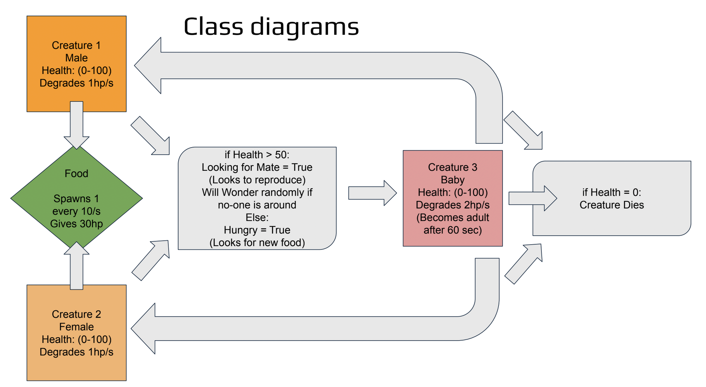
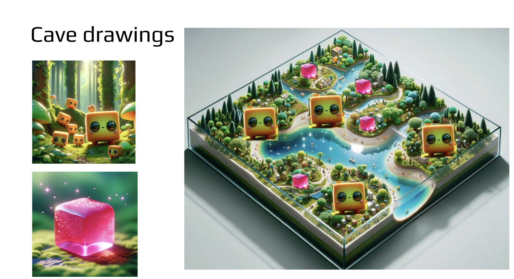
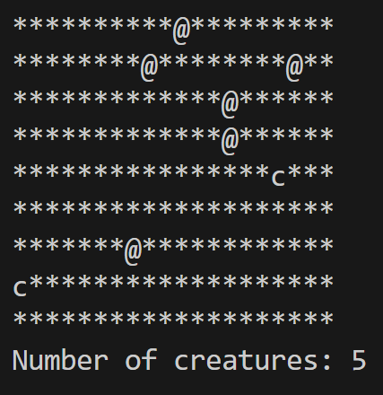

# Evolution Terminal Simulation

[Chat with ChatGPT 4.0](https://chat.openai.com/share/eef45ead-8d48-4644-a29b-a3eb02ec815d)

Original Description of Project:

## Descriptions

- Plan to use Python
- Want to set up a similar format to the example shown in class.
- ASCII Art in the terminal to represent the Map + Creatures.
- (Might switch if its too complicated)
- Creatures will have 2 genders and need one of each to reproduce.
- There will be 2 main statuses (Hungry and Looking for mate)
and a third idle status which is walking when no-one is around.

### Class Diagrams

### Cave Drawings

### Summary

Overall this was a fun project to think about conceptually. The actual implementation was harder then I expected.

I used Python and the Terminal + ASCII art for the project. Looking back using something like unity might have worked a bit better. But this did lead to a unique look.

### Game Screen Shot

